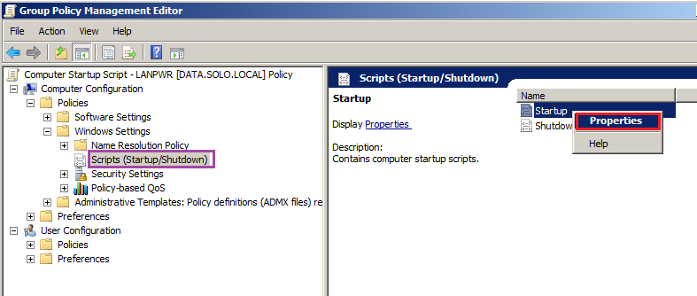

### Deploying the Huntress Agent using Powershell

This Powershell script will install the Huntress Agent. The script will automatically download the installer from the Huntress servers and run it. The script does basic error checking and logging as well. (It will check to see if the agent is already installed and also verfiy the installation completed.)

You have the option to hard code your Huntress account key and the organization key in the script or pass either as an argument to the script. [Click here for more details regarding the Account Key and Organization Key.](https://support.huntress.io/article/7-using-account-and-organization-keys)

Usage:
```
powershell -executionpolicy bypass -f ./InstallHuntress.powershellv1.ps1 [-acctkey <account_key>] [-orgkey <organization_key>]
```
#### Batch File Wrapper

We have also included a batch file, `InstallHuntress.bat`, to be used as a wrapper. This is useful if your RMM/SCCM application does not manage the Powershell [`executionpolicy`.](https://docs.microsoft.com/en-us/powershell/module/microsoft.powershell.security/set-executionpolicy?view=powershell-3.0)

You'll need to edit the batch file, adding your Huntress account key. Then you can run the batch file as follows:

```
InstallHuntress.bat <organization_key>
```

#### Using the script via a GPO

We've had several of our partners use this Powershell script with a GPO. The "startup script" is the best option because it will install with SYSTEM (local administrator) privileges before any user logs in. The caveat is the system will need to be rebooted before the install will occur.

The startup script is located in Computer Configuration | Policies | Windows Settings | Scripts | Startup


